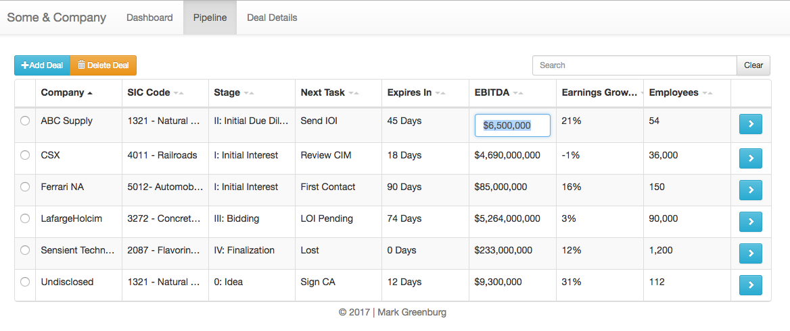
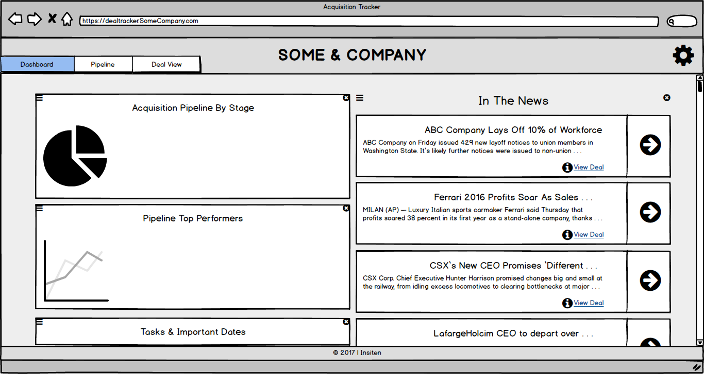
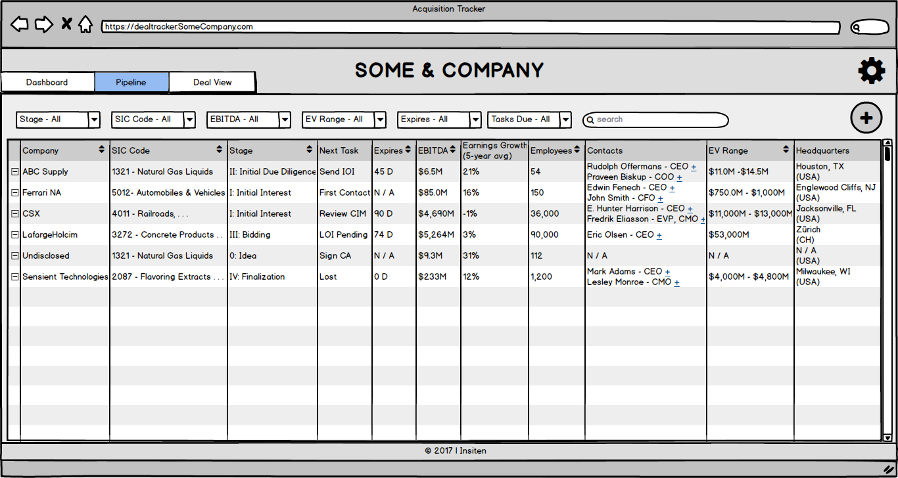
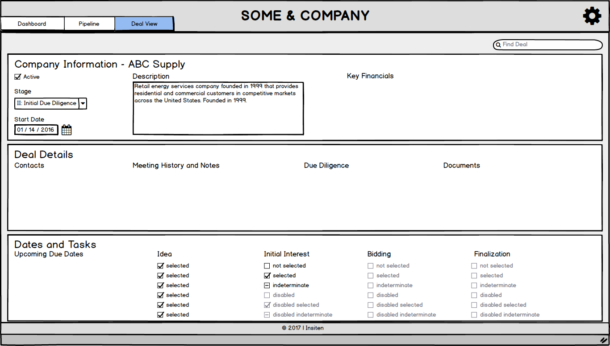

# acquisitiontracker
React & Redux tracker for buy-side m&amp;a deals

Editable, searchable, filterable Pipeline view:

Deal Details view:

## Installation (tested on Mac OS 10.12.4) ##
* GIT-clone repo or download and extract to directory of your choice
* Project uses NPM package manager so once in root project directory, just `npm install` to resolve dependencies. _Note:_ be sure to include `node_module/*` directory in your `.gitignore` to ensure you're not unnecessarily uploading all dependencies to GIT. 
* Install ES Lint, if not installed already. The eslintrc.json and aribnb configs depend on this linter.

## Testing / Local Startup ##
* To run locally, run `npm start` from root project directory. If this does not open a new Chrome tab for you, navigate to `http://localhost:3000/`.

## Background ##
Project went through three main phases:
1. Research
    * M & A Research: 
        * [Protiviti M&A Guide](https://www.protiviti.com/sites/default/files/united_states/insights/guide-to-mergers-acquisitions-faqs-protiviti.pdf)
        * [Mentor Group M&A Guide](http://www.thementorgroup.biz/documents/merger_aqui_phases.pdf)
        * [Stout, Risius, and Ross M&A Guide](https://www.srr.com/assets/pdf/mabuysideprocess.pdf)
    * M&A CRM / Deal Tracker Research: Two Main Players
        * Navatar, which provides customized solutions built on the Salesforce platform (in addition to a lot of other stuff)
        * Atrio CRM, which does the same but utilizing the Microsoft Dynamics CRM platform
2. Design & scoping
    * Dashboard, deal list, and deal detail views were designed in mock using `Balsamiq` for rapid prototyping.
    * MVP features were considered based on the original project requirements as well as the competitive landscape. Assumptions:
        * Focus on details list view (as opposed to Dashboard functionality)
        * Basic CRUD functionality for deals is a must-have
        * Framework must be JS and reasonably modern
        * No backend or data persistence - initial state should be hardcoded (e.g., provided in a file and populated into the app on reload).
3. Build
    * Tech:
        * React
        * Redux for state management
        * Jasmine testing framework
        * ES-Lint with AirBnB styleguide presets
        * Maybe Webpack. Maybe...

## Design Mocks

### Dashboard

### Deals List

### Deal Details

